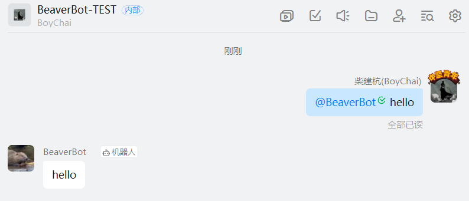

# BeaverBot

## 概述

钉钉机器人开发库
## 快速开始

### 要求

- go 1.18以上

### 安装

```
$ go get -u github.com/BoyChai/BeaverBot
```

### 使用

使用之前需要配置钉钉机器人的消息推送地址并且需指定`服务器出口IP`事件主机为本程序主机和端口，之后，创建一个名为`example.go`：

```
$ touch example.go
```

接下来，将以下代码放入`example.go`：

```
package main

import (
	"github.com/BoyChai/BeaverBot"
)

func main() {
	h, _ := BeaverBot.NewHandle("你的appKey", "你的AppSecret")
	var e BeaverBot.Event
	c := []BeaverBot.Condition{{
		Key:   &e.Text.Content,
		Value: "hello",
		Regex: true,
	}}
	BeaverBot.NewTask(BeaverBot.Task{
		Condition: c,
		Run: func() {
			msg := BeaverBot.NewTextMsg("hello")
			h.SendGroupMessages(h.AppKey, msg, e.ConversationId)
		},
	})

	BeaverBot.RunBeaverBot(":8080", &e)
}


```

您可以通过以下方式运行代码`go run example.go`，运行之后可以在群聊里面@机器人发送hello即可收到回复。效果如下：

